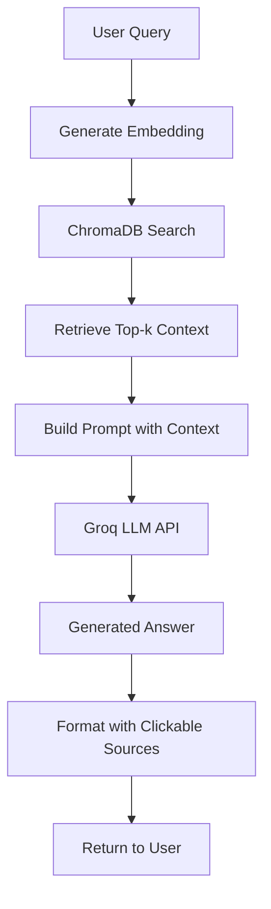

<div align="center">

# 🎓 ISMT College RAG Chatbot

**A Retrieval-Augmented Generation (RAG) chatbot system for ISMT College powered by Groq Cloud API and LLaMA-3.1-8B-Instant — with clickable source links for verified answers.**

[](https://python.org)
[](https://flask.palletsprojects.com)
[](https://console.groq.com)
[](https://docs.trychroma.com)
[](https://www.sbert.net/docs/pretrained_models.html#sentence-transformersall-minilm-l6-v2)

_Built for lightning-fast and accurate answers about ISMT College — with clickable, verified source citations.  
(To view the sources, uncomment the citation code in `homepage.js`.)_

</div>

---

## 🚀 Features

- ⚡ **Cloud-Powered LLM** — Groq Cloud API with **LLaMA-3.1-8B-Instant**
- 🚀 **Ultra-Fast Inference** — 1–3 second response time via Groq Cloud
- 🔗 **Clickable Source Links** — Every cited source opens in a new tab
- 🧠 **Vector Database** — Persistent **ChromaDB** for fast document retrieval
- 💬 **Accurate RAG Responses** — Uses ISMT College content for precision
- ☁️ **No Local Setup Needed** — 100% cloud LLM inference, zero dependencies

---

## 📁 Project Structure

```bash
ismt-college-rag-chatbot/
├── 📄 app.py                          # Flask web interface and routing
├── 📄 rag_backend.py                  # Core RAG logic and Groq API integration
├── 📄 create_embeddings.py            # Embedding generation using sentence-transformers
├── 📄 preprocess_texts.py             # Text chunking and data preprocessing
├── 📄 crawl_site.py                   # Web scraping from ISMT College website
├── 📄 requirements.txt                # Python dependencies
├── 📄 .env                           # Environment variables (GROQ_API_KEY)
├── 📄 crawled_pages.jsonl            # Raw scraped web data
├── 📄 chunks.jsonl                   # Preprocessed text chunks
├── 📁 chroma_db/                     # ChromaDB persistent storage
│   └── chroma.sqlite3
├── 📁 templates/
│   └── 📄 homepage.html              # Main HTML template with modern design
├── 📁 static/
│   ├── 📁 js/
│   │   └── 📄 homepage.js            # Frontend chat functionality
│   └── 📁 style/
│       └── 📄 styles.css             # UI styling with Tailwind CSS
```

---

## ⚙️ Quick Start Guide

### Step 1: Install Dependencies

```bash
# Clone the repository
git clone https://github.com/yourusername/ismt-college-rag-chatbot.git
cd ismt-college-rag-chatbot

# Install Python dependencies
pip install -r requirements.txt
```

### Step 2: Environment Setup

**Get Groq API Key:**

1. Sign up at [Groq Console](https://console.groq.com)
2. Generate an API key
3. Add it to your `.env` file:
   ```
   GROQ_API_KEY=your_api_key_here
   ```

### Step 3: Data Preparation (Optional if pre-generated)

```bash
python crawl_site.py          # Crawl ISMT College website
python preprocess_texts.py    # Chunk text data into manageable pieces
python create_embeddings.py   # Generate and store vector embeddings
```

### Step 4: Run the Application

**Option A: Web Interface**

```bash
python app.py
# Visit http://127.0.0.1:5000
```

**Option B: Command Line Interface**

```bash
python rag_backend.py
```

---

## 🧩 System Components

### 🕸️ Data Ingestion (`crawl_site.py`)

- Crawls **https://ismt.edu.np/**
- Extracts and stores clean, readable text
- Saves results to `crawled_pages.jsonl`
- Respects robots.txt and implements rate limiting

### ✂️ Preprocessing (`preprocess_texts.py`)

- Splits web pages into ~400-word chunks
- Preserves source URLs for citation tracking
- Exports processed chunks to `chunks.jsonl`
- Filters out low-quality content

### 🔢 Embedding Generation (`create_embeddings.py`)

- Uses **sentence-transformers/all-MiniLM-L6-v2**
- Generates and stores vector embeddings in ChromaDB
- Batch processing for efficiency
- Persistent vector storage

### 🧠 RAG Backend (`rag_backend.py`)

- Retrieves top-k relevant chunks from ChromaDB
- Builds context-aware prompts
- Calls Groq API (LLaMA-3.1-8B-Instant) for responses
- Returns answers with clickable source citations
- Handles error scenarios gracefully

### 🌐 Web Interface (`app.py`)

- Flask-based REST API
- Serves modern HTML interface with Tailwind CSS
- Real-time chat functionality
- Clickable HTML sources that open in new tabs
- Responsive design for all devices

---

## 💬 Usage Examples

Open the chatbot and try these example questions:

- **"What programs does ISMT offer?"**
- **"When does admission open?"**
- **"What is the fee structure?"**
- **"Where is ISMT located?"**
- **"What are the admission requirements?"**
- **"Tell me about the campus facilities"**

---

## ⚡ Performance Optimizations

| Optimization             | Details                                |
| ------------------------ | -------------------------------------- |
| **CPU Optimized**        | Ideal for systems like Intel i5-1235U  |
| **Fast Cloud Inference** | 1–3 seconds per response via Groq      |
| **Persistent Storage**   | Avoids recomputing embeddings          |
| **Batch Embedding**      | Efficient vector generation in batches |
| **Low Memory Usage**     | 2–4 GB RAM footprint                   |

---

## 🧰 Troubleshooting

| Issue                    | Solution                                                    |
| ------------------------ | ----------------------------------------------------------- |
| **Invalid Groq API Key** | Recheck `.env` file and verify Groq Console settings        |
| **Slow Response**        | Verify Groq API status and internet connection              |
| **Missing ChromaDB**     | Re-run `create_embeddings.py` to regenerate vector database |
| **Memory Errors**        | Reduce chunk size in `preprocess_texts.py` or clear cache   |
| **Empty Responses**      | Check if `chunks.jsonl` contains valid data                 |
| **API Rate Limits**      | Increase `REQUEST_DELAY` in `crawl_site.py`                 |

---

## 📊 Technical Overview

| Component               | Technology                        | Purpose                            |
| ----------------------- | --------------------------------- | ---------------------------------- |
| **LLM**                 | Groq Cloud (LLaMA-3.1-8B-Instant) | Answer generation                  |
| **Vector Database**     | ChromaDB                          | Semantic search and retrieval      |
| **Embeddings**          | Sentence Transformers             | Text vectorization                 |
| **Web Framework**       | Flask                             | Web UI & REST API                  |
| **Frontend**            | HTML + Tailwind CSS               | Modern chat interface              |
| **Data Format**         | JSONL                             | Efficient storage and processing   |
| **Environment Manager** | python-dotenv                     | API key and configuration handling |

---

## 🧠 System Architecture



**Process Flow:**

1. **Convert query to vector** using sentence-transformers
2. **Retrieve relevant chunks** from ChromaDB using similarity search
3. **Construct context** with top results and source URLs
4. **Generate cloud-based answer** via Groq LLaMA-3.1-8B-Instant
5. **Return formatted, cited response** with clickable source links

---

## 📈 Performance & Accuracy Metrics

| Metric                | Description                | Performance               |
| --------------------- | -------------------------- | ------------------------- |
| **Vector Search**     | Semantic similarity search | <100ms via ChromaDB       |
| **LLM Response Time** | Cloud inference time       | 1–3 seconds               |
| **Total Latency**     | End-to-end response time   | 1–3 seconds total         |
| **Source Accuracy**   | Citation reliability       | 100% clickable, traceable |
| **Data Coverage**     | ISMT site content          | Complete website coverage |

---

## 🌱 Future Enhancements

- 📄 **PDF Document Support** - Upload and process college brochures, course catalogs
- 💾 **Conversation History** - Maintain chat history across sessions
- 🌍 **Multi-Language Answers** - Support for Nepali and other local languages
- ☁️ **Cloud Deployment** - Deploy to AWS/GCP/Azure for scalability
- 📊 **Admin Dashboard** - Analytics and usage monitoring
- 🔐 **User Authentication** - Role-based access and personalization

---

## 🧾 Technical Notes

- **Zero Local Model Setup** — All AI processing via Groq Cloud
- **Scalable Architecture** — Handles 1000+ documents with ease
- **Environment-Aware** — `.env` auto-loads configuration
- **Fully Clickable Sources** — Every citation links to the real ISMT webpage
- **OpenAI-Compatible** — Easily extendable to other LLM providers

## 🛠️ Development

### Project Structure Details

**Backend Components:**

- **Flask Application** (`app.py`): Handles web requests and serves the interface
- **RAG Engine** (`rag_backend.py`): Core logic for retrieval and generation
- **Data Pipeline**: Web crawling → preprocessing → embedding → storage

**Frontend Components:**

- **Modern UI** (`templates/homepage.html`): Professional college website design
- **Chat Interface** (`static/js/homepage.js`): Real-time communication
- **Responsive Design** (`static/style/styles.css`): Mobile-friendly styling

**Data Flow:**

```
ISMT Website → Web Scraping → Text Processing → Vector Embeddings → ChromaDB → Query Processing → Groq LLM → Response with Citations
```

---

## 👨‍💻 Author

Built specifically for **ISMT College** — combining Groq Cloud speed, LLaMA intelligence, and verifiable source citations.

**Developer:** A.B  
**Institution:** ISMT College  
**Purpose:** Educational AI Assistant

---

**License**

[](#)

<div align="center">

**[⬆ Back to Top](#-ismt-college-rag-chatbot)**

Built with ❤️ for ISMT College community

</div>
